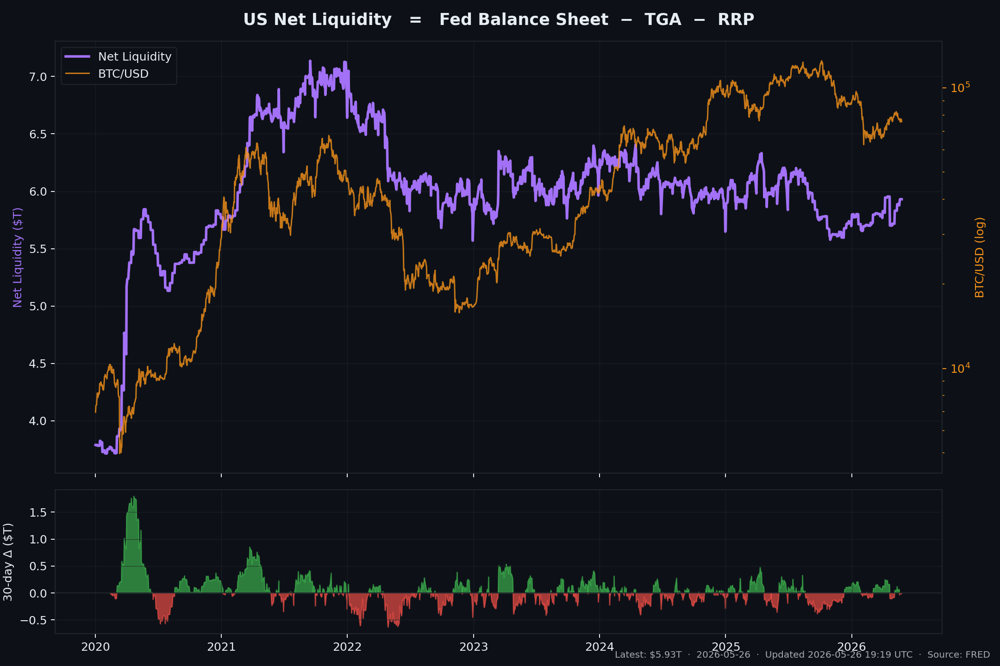
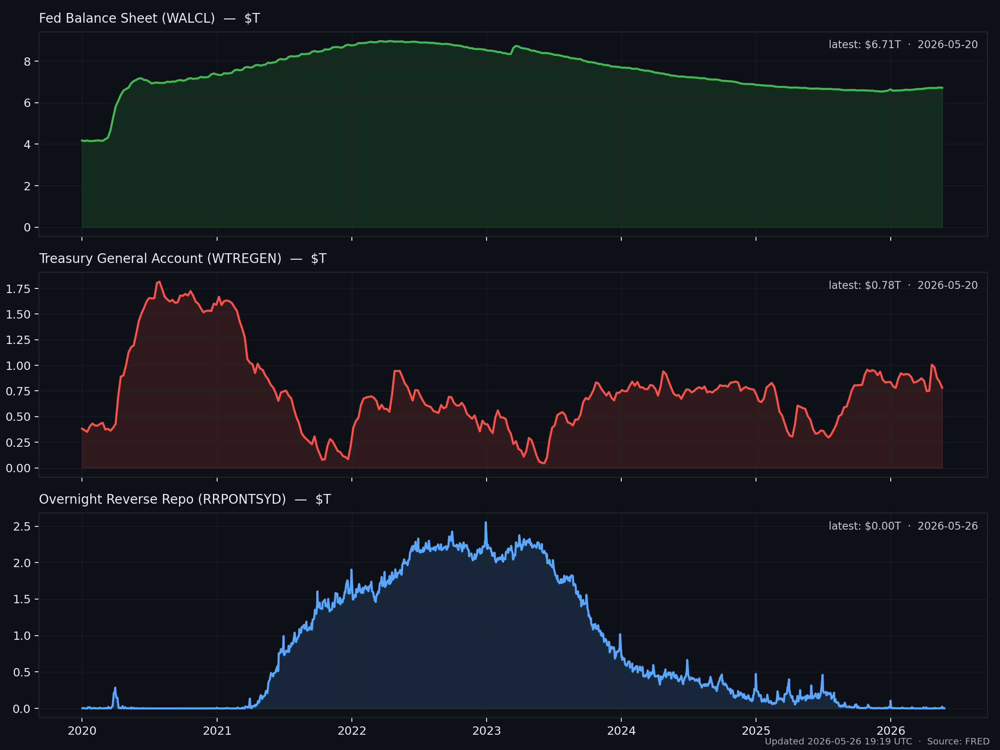

# Net Liquidity Dashboard

> Daily-updated dashboard tracking US Net Liquidity (Fed balance sheet − TGA − RRP) and its components. Refreshed automatically via GitHub Actions.



Net Liquidity is the most-watched coincident proxy for the dollar liquidity that drives risk assets. The formula is simple; reading the regimes is not.

```
Net Liquidity  =  Fed Balance Sheet  −  Treasury General Account  −  Overnight Reverse Repo
                  (WALCL)               (WTREGEN)                    (RRPONTSYD)
```

- **WALCL** rising → QE / asset purchases adding base money.
- **WTREGEN** rising → Treasury issuance draining bank reserves (and vice versa as it spends).
- **RRPONTSYD** rising → cash parked at the Fed instead of chasing risk assets.

The top panel shows Net Liquidity in trillions against BTC/USD on a log scale. The bottom panel shows the 30-day change — green when liquidity is being added to the system, red when it's being withdrawn.

## Components



## Methodology

- Data is pulled from FRED's public CSV endpoints — no API key required.
- WALCL is reported in millions of dollars; WTREGEN and RRPONTSYD in billions. All series are normalized to trillions before plotting.
- Series are forward-filled across non-aligned release schedules (WALCL is weekly Thursday; WTREGEN/RRPONTSYD are business-daily).
- Charts re-render daily at **22:00 UTC** — chosen to land after the Thursday H.4.1 release at ~21:30 UTC.

## Why this matters

Asset prices respond to liquidity changes before they respond to fundamentals. Net Liquidity has historically led BTC by 0–8 weeks at major turns; it has the same relationship — weaker but present — with the SPX growth complex.

It is not a strategy. It is a regime gauge. Use it to:

1. **Frame the bias.** Adding liquidity → don't fight risk; draining → respect downside.
2. **Time TGA refills.** Quarterly refunding announcements move WTREGEN; the announcement-vs-actual gap is the trade.
3. **Watch the RRP drain.** Falling RRP releases cash into bills and back into the system — a positive flow even without WALCL moving.

## Running locally

```bash
python -m venv .venv
source .venv/bin/activate          # Windows: .venv\Scripts\activate
pip install -r requirements.txt
python update.py
```

Outputs land in `charts/` and `latest.json`.

## Data sources

- [FRED — WALCL](https://fred.stlouisfed.org/series/WALCL) — Federal Reserve total assets.
- [FRED — WTREGEN](https://fred.stlouisfed.org/series/WTREGEN) — Treasury General Account.
- [FRED — RRPONTSYD](https://fred.stlouisfed.org/series/RRPONTSYD) — Overnight reverse repurchase agreements.
- [Yahoo Finance — BTC-USD](https://finance.yahoo.com/quote/BTC-USD) — Reference price for the overlay.

## Related

- [awesome-macro-liquidity](https://github.com/ruleaker/awesome-macro-liquidity) — Curated resource list for tracking macro liquidity.
- [awesome-derivatives-data](https://github.com/ruleaker/awesome-derivatives-data) — Derivatives-side data that the liquidity flows feed into.

## License

[MIT](LICENSE)
